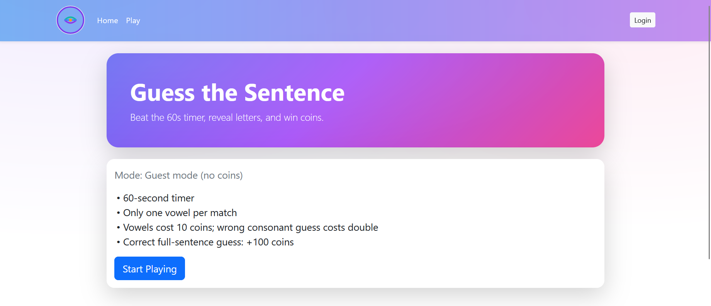
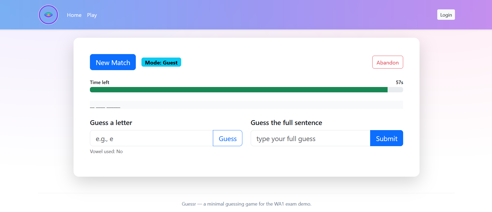
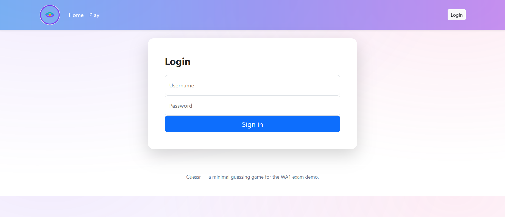
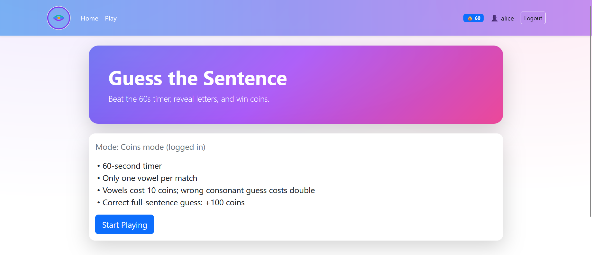
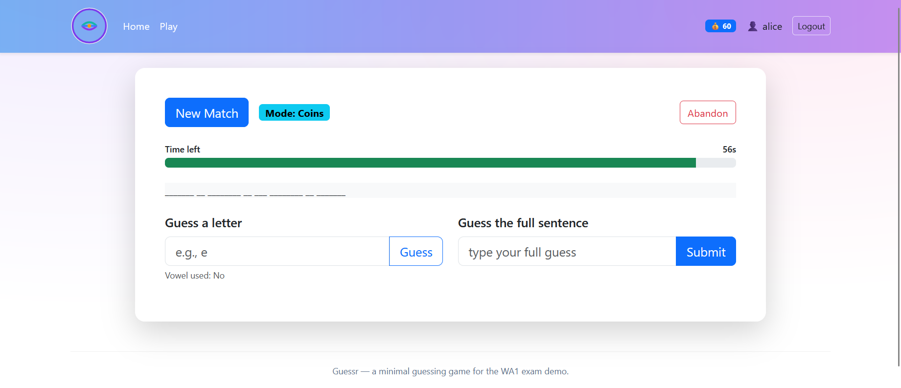

# Exam #3: "Guess a Sentence"
## Student: s329717 Khaledipaveh Mona

## React Client Application Routes

- Route `/` (Home): Landing page with a hero section (“Guess the Sentence”), a short rules recap, and CTAs. Shows current mode:
  - **Coins mode** if user is logged-in,
  - **Guest mode** if not logged-in.
- Route `/login`: Login form (username/password). On success it redirects to `/play`.
- Route `/play`: Match board. Start a new match, see the 60s timer, masked sentence grid, **guess a letter**, **guess the full sentence**, or **abandon**. When the match ends, the full sentence is revealed.

> No parameterized routes are used.

## API Server

Base URL: `http://localhost:3001/api`

- **POST `/sessions`** — login  
  **Body:** `{ "username": string, "password": string }`  
  **200 →** `{ id, username, coins }`  
  **401 →** `{ error: string }`

- **GET `/sessions/current`** — current user (session cookie)  
  **200 →** `{ id, username, coins }` if logged-in  
  **401 →** `{ error }` if not logged-in

- **DELETE `/sessions/current`** — logout  
  **204** (no content)

- **POST `/matches`** — start a new match  
  **Auth:** optional (guest allowed)  
  **201 →** `{ id, status:"ongoing", secondsLeft:60, vowelUsed:false, mask, isGuest:boolean }`

- **GET `/matches/:id`** — get match state  
  **200 →** if ongoing: `{ id, status, secondsLeft, vowelUsed, mask, isGuest }`  
  if finished: `{ id, status, sentence, isGuest }` (reveals the sentence)

- **POST `/matches/:id/guess-letter`** — guess a single letter  
  **Body:** `{ "letter": "a" }` (exactly one A–Z)  
  **200 →** updated `{ id, status, secondsLeft, vowelUsed, mask }`  
  **400/404/409 →** validation, not found, or finished/time over

- **POST `/matches/:id/guess-sentence`** — guess the full sentence  
  **Body:** `{ "sentence": string }`  
  **200 →** if equal: `{ id, status:"won", secondsLeft, sentence }`  
  else: `{ id, status:"ongoing", secondsLeft, message }`

- **POST `/matches/:id/abandon`** — abandon the match  
  **200 →** `{ id, status:"abandoned", sentence }`

## Database Tables

- **`users`** — registered players  
  Columns: `id (PK)`, `username UNIQUE`, `hash` (bcrypt), `coins INTEGER`

- **`sentences`** — pool of English sentences  
  Columns: `id (PK)`, `text`, `is_guest_only INTEGER (0/1)`

- **`matches`** — played matches  
  Columns:  
  - `id (TEXT, PK, uuid)`, `userId (INTEGER NULL)`, `sentenceId (INTEGER)`,  
  - `startedAt (TEXT ISO)`, `endedAt (TEXT ISO NULL)`,  
  - `status ("ongoing"|"won"|"abandoned"|"timeout")`,  
  - `secondsLeft (INTEGER)`, `vowelUsed (INTEGER 0/1)`,  
  - `revealedMask (TEXT)`, `isGuest (INTEGER 0/1)`

- **`moves`** — audit trail of moves in a match  
  Columns: `id (TEXT, PK)`, `matchId (TEXT FK)`, `type` (`guess_letter`|`guess_sentence`|`timeout`|`abandon`), `payload (TEXT JSON NULL)`, `deltaCoins (INTEGER)`, `createdAt (TEXT ISO)`

## React Client Application Routes

- **Route `/` (Home)**: Landing page with a hero section (“Guess the Sentence”), a short rules recap, and CTAs. Shows the current mode:
  - **Coins mode** if the user is logged in.
  - **Guest mode** if the user is not logged in.

- **Route `/login`**: Login form (username/password). On success, it redirects to `/play`.

- **Route `/play`**: Match board. Start a new match, see the 60s timer, masked sentence grid, **guess a letter**, **guess the full sentence**, or **abandon**. When the match ends, the full sentence is revealed.

> No parameterized routes are used.

## Main React Components

- **`App`** (`client/src/App.jsx`): App shell (Navbar + routes). Reads current session, shows mode & user coins.
- **`Home`** (inside `App.jsx`): Hero section + rules + CTAs (Start Playing / Login).
- **`Login`** (`client/src/Login.jsx`): Floating-label login form; calls `POST /sessions`; redirects to `/play`.
- **`MatchBoard`** (`client/src/MatchBoard.jsx`): Match UI (new match, progress/timer, masked grid, guess letter/full sentence, abandon). Polls server for `secondsLeft` and updates mask. Refreshes user coins after moves.
- **`api`** (`client/src/api.js`): Axios instance with `baseURL` and `withCredentials:true`.

(Other minor components/utilities are omitted.)

## Screenshot

Place a screenshot (match in progress) at: **`img/screenshot.jpg`**  
Then this link will work:

## Users Credentials

- `alice` / `alice` — starts with **100** coins, **zero games** seeded  
- `bob` / `bob` — starts with **0** coins (depleted)  
- `charlie` / `charlie` — **played some matches** pre-seeded, coins set to **185** by seed

> Coins are **reset on every server start** (see `server/src/db.js`, reset block). Change the values there if you prefer different starting amounts.

